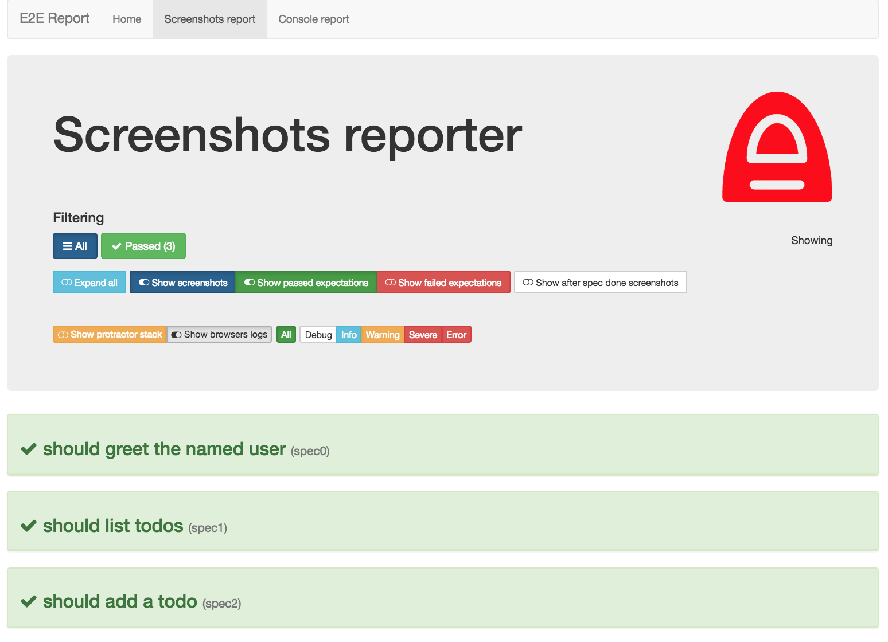
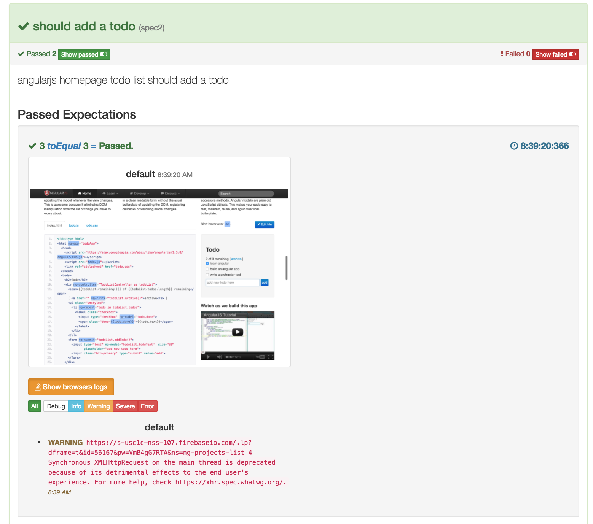
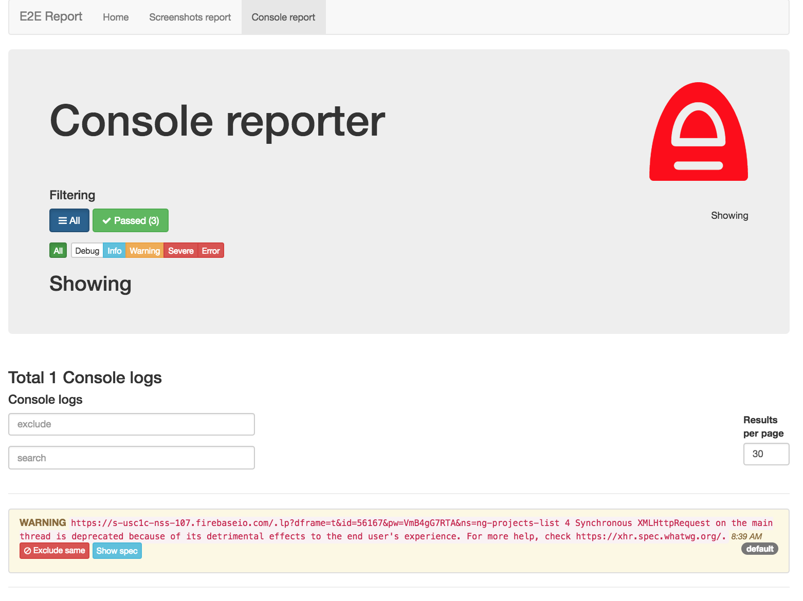
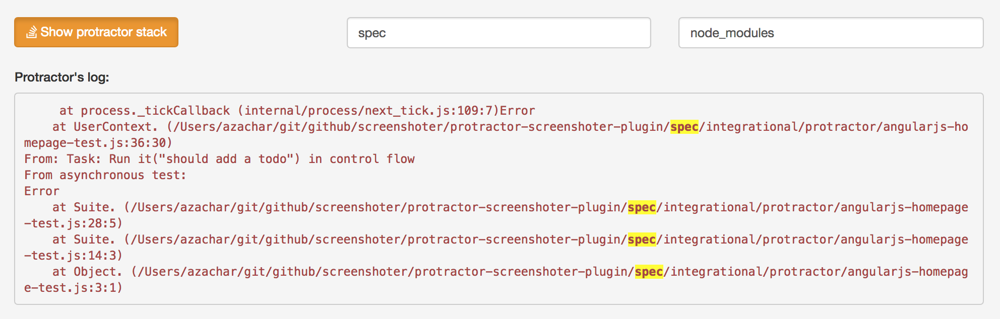
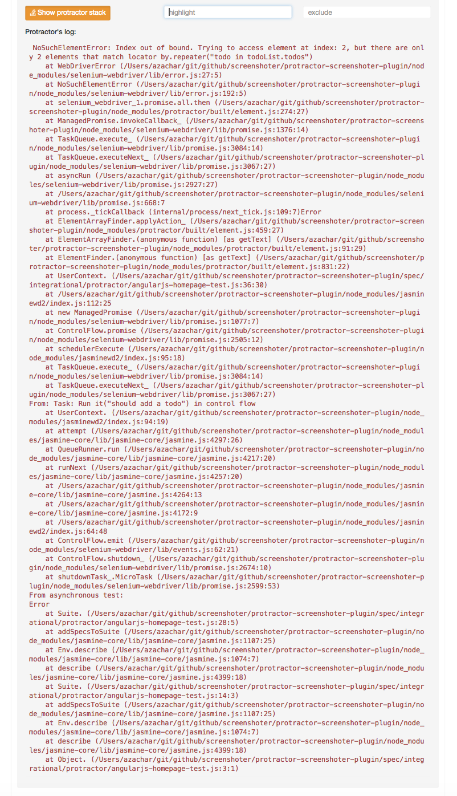

# screenshoter-report-analyzer

A tiny beautiful angular based analytics tool to visually represents protractor tests results from
https://github.com/azachar/protractor-screenshoter-plugin

### Screenshots
##### Reporter Controls

#####  Expanded Spec

#####  Console log management

#####  Stacktrace filtering

Instead of

## Development

#### To run the app

``gulp serve``

It comes autimatically with seed data located in ``e2e/seed``

#### To launch tests

``gulp test``  (Unit tests)

``gulp protractor`` (E2E tests)

To pause protractor at the place of e2e test failure, set the environmental variable TEST_DEBUG as follow prior the execution of gulp 

``export TEST_DEBUG=true``

#### To make a build

``gulp build``
